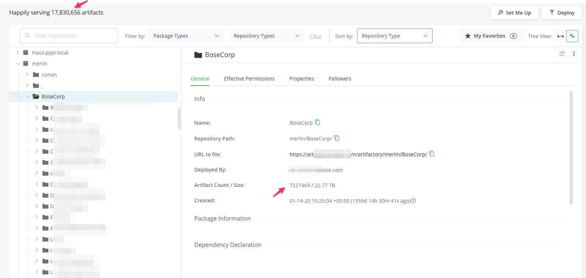

# Artifactory Migration Script

When migrating a repo using the [jf rt transfer-files](https://jfrog.com/help/r/jfrog-cli/step-5-push-the-files-from-the-source-to-the-target-instance) tool or via push replication , it may fail 
as  explained in [Why Large Repository Push Replications Can Fail](https://jfrog.com/help/r/why-large-repository-push-replications-can-fail/why-large-repository-push-replications-can-fail)

For example , the replication status shows:
```
jf rt curl -k -n -XGET "/api/replication/merlin" --server-id usvartifactory5

Output:
{
  "status" : "error",
  "lastCompleted" : "2023-10-04T15:37:45.102Z",
  "targets" : [ {
    "url" : "https://xyz.jfrog.io/artifactory/merlin/",
    "repoKey" : "merlin",
    "status" : "error",
    "lastCompleted" : "2023-10-04T15:37:45.102Z"
  } ],
  "repositories" : {
    "merlin" : {
      "status" : "error",
      "lastCompleted" : "2023-10-04T15:37:45.102Z"
    }
  }
}
```

This is because  7+ million artifacts  out of 17+ million in the Artifactory are  under one folder in the monorepo and so generating the filelist will timeout.
 .  

This `merlin` mono-repo has 23.48 TB data  and 9.5 million artifacts.

Another `liquid` monorepo which is only 1.61 TB has simlar issue ( most of the artifacts are under ` liquid/BoseCorp/`)  and so following fails :
```
jf rt cp liquid/BoseCorp/  sureshv-liquid-generic/ --flat=false --threads=8 --dry-run=false --server-id YOUR_RT_SERVERID
```

It fails with:
```
15:23:08 [Debug] JFrog CLI version: 2.46.2
15:23:08 [Debug] OS/Arch: darwin/amd64
15:23:08 [🔵Info] Searching artifacts...
15:23:08 [Debug] Usage Report: Sending info...
15:23:08 [Debug] Searching Artifactory using AQL query:
 items.find({"type":"any","path":{"$ne":"."},"$or":[{"$and":[{"repo":"liquid","path":"BoseCorp","name":{"$match":"*"}}]},{"$and":[{"repo":"liquid","path":{"$match":"BoseCorp/*"},"name":{"$match":"*"}}]}]}).include("name","repo","path","actual_md5","actual_sha1","sha256","size","type","modified","created")
15:23:08 [Debug] Sending HTTP POST request to: https://xyz.jfrog.io/artifactory/api/search/aql
15:23:08 [Debug] Sending HTTP GET request to: https://xyz.jfrog.io/artifactory/api/system/version
15:23:08 [Debug] Artifactory response: 200 OK
15:23:08 [Debug] JFrog Artifactory version is: 7.41.14
15:23:08 [Debug] Sending HTTP POST request to: https://xyz.jfrog.io/artifactory/api/system/usage
15:23:09 [Debug] Usage Report: Usage info sent successfully. Artifactory response: 200 OK

15:24:09 [Debug] Artifactory response: 200 OK
15:24:09 [Debug] Streaming data to file...
15:35:23 [Debug] Finished streaming data successfully.
15:35:44 [🚨Error] unexpected EOF
15:35:44 [🚨Error] unexpected EOF
15:35:44 [🚨Error] unexpected EOF
15:35:44 [🚨Error] copy finished with errors, please review the logs
15:35:44 [🚨Error] copy finished with errors, please review the logs
```
Another issue is RTFACT-22800 - filelist gets progressively slower the larger a repository gets.

To overcome these  issues I reviewed the  [transfer.sh](https://git.jfrog.info/projects/PROFS/repos/ps_jfrog_scripts/browse/transfer-artifacts/transfer.sh) , but that will also not work for this monorepo. 

So I improved on the the `transfer.sh` and wrote this [migrate_n_subfolders_in_parallel.sh](migrate_n_subfolders_in_parallel.sh) Bash script which can :
- migrate artifacts in the above mentioned monorepo from the source Artifactory instance to the target Artifactory instance as it supports migrating files and subfolders by traversing the tree recursively until it finds the leaf folder and then works it way up the tree. 
- It also provides the option to transfer only the files in root folder ( and not the subfolders).
- It also PATCHES the properties for all the migrated artifacts.
- You can use it to transfer files in a specific folder ( and / or its subfolders as well).
- It does the diff between the source and target not only based on repo path  and the checksum of the artifacts. The  checksum diff is useful when Dev builds overwrite an artifact previously published in the same  repo path ( for example the manifest.json of the docker images).

It differs from  [repodiff.py](../../../after_migration_helper_scripts/repoDiff/repodiff.py)  which  finds the diff only based on repo path and not checksum.

## Usage

```bash
./migrate_n_subfolders_in_parallel.sh <source-artifactory-serverid> <source-repo> \ 
<target-artifactory-serverid>  <target-repo> <transfer yes/no> \
    [root-folder] [target_repo_root_folder] [migrateFolderRecursively yes/no] [semicolon separated exclude_folders] \
    [parallel background jobs count]"
```

- source-artifactory: The source Artifactory instance.
- source-repo: The source repository in the source Artifactory instance.
- target-artifactory: The target Artifactory instance.
- target-repo: The target repository in the target Artifactory instance.
- transfer yes/no: Specify 'yes' to transfer files or 'no' to perform other operations without transferring.
- root-folder (optional): The source repo root folder to start the migration from (default is the "." i.e the 
  source repository's root directory).
- target_repo_root_folder (optional): The target repo folder to  copy to. 
Note: If you have you specify any of the remaining `optional` parameters  then you have to specify the 
  target_repo_root_folder. If not overriding the target_repo_root_folder specify it as an empty string i.e "" , so 
  that you can pass the remaining optional parameters.
- migrateFolderRecursively yes/no (optional): Specify 'yes' to migrate subfolders recursively or 'no' to only migrate the root folder (default is 'yes').
- semicolon-separated exclude_folders (optional): List of folders to exclude from migration, separated by semicolons. ( default is ';.conan;')
- parallel_count (optional): Counter to limit parallel  execution i.e max number of concurrent background
  execute_artifact_migration jobs . ( default is 16)

## Prerequisites

The script requires the following tools on a linux/unix box ( it does not work on mac OS yet)  and assumes the jf is configured to connect to both   source and target Artifactory instances :
```
jf ( which you can install using "sudo yum install jf")
comm ( which you can install using "sudo yum install coreutils")
tr
sed
```
Note: Regularly clean up the `jfrog-cli*.log` files located in your `~/.jfrog/logs` folder. This script executes numerous JFrog CLI commands, each generating a new `jfrog-cli*.log` file.

## Execution
The script creates an "output" folder and runs the migration inside it. It processes files and subfolders in parallel to optimize performance.

- It lists files in the source and target repositories using AQL queries.
- Compares the file lists and identifies files to transfer.
- Transfers files and their properties from the source to the target repository.
- The script logs :
    - all the successful  uploads to output/successful_commands.txt
    - If there are failures it logs to  output/failed_commands.txt ( note: you may not see the failed_commands.txt if there are not upload failures).
- When the script completes , in the output/successful_commands.txt you should see:
```
All transfers for $source_repo completed
```
For example for the merlin repo you will see:
```
All transfers for merlin completed
```
## Configuration
- parallel_count: Controls the maximum number of parallel execution threads.
- failed_commands_file: Records failed commands .
- successful_commands_file: Records successful commands.
- all_commands_file: Logs all commands executed.

## Functions
- execute_artifact_migration: Executes migration commands for a single artifact.
- run_migrate_command: Runs the migration commands for a folder and its subfolders.
- run_migration_for_folder: Manages the migration process for a folder and its subfolders.
- migrateFolderRecursively: Recursively migrates subfolders.
- processLeafFolderContents: Migrates files in leaf folders and subfolders.

## Example:
```
./migrate_n_subfolders_in_parallel.sh <source-artifactory-serverid> <source-repo> <target-artifactory-serverid> <target-repo> yes
```


You can also give a specific folder or file path , for example:
```
./migrate_n_subfolders_in_parallel.sh <source-artifactory-serverid> <source-repo> <target-artifactory-serverid> <target-repo> yes com/ncr/ndce/tools/ndce-host
```
or
```
./migrate_n_subfolders_in_parallel.sh <source-artifactory-serverid> <source-repo> <target-artifactory-serverid> <target-repo> yes com/ncr/ndce/tools/ndce-host/ndce-host-.pom
```

To migrate a specific folder "com/xyz/ndce/tools/ndce-host" recursively run as:
```
./migrate_n_subfolders_in_parallel.sh <source-artifactory-serverid> <source-repo> <target-artifactory-serverid> 
<target-repo> yes "com/xyz/ndce/tools/ndce-host" "" yes
```
To migrate a specific folder "com/xyz/ndce/tools/ndce-host" recursively to the target <target-repo> under folder 
`abc/test` run as :
```
./migrate_n_subfolders_in_parallel.sh <source-artifactory-serverid> <source-repo> <target-artifactory-serverid> 
<target-repo> yes "com/xyz/ndce/tools/ndce-host" "abc/test" yes
```

To exclude certain folders from transferring to target artifactory you can pass as 
[semicolon-separated exclude_folders] as:
```
./migrate_n_subfolders_in_parallel.sh <source-artifactory-serverid> <source-repo> <target-artifactory-serverid> 
<target-repo> yes . "" yes "folder1;folder2"
```

You can run it using screen utility using:
```
screen -dmS upload-session9 bash -c '/app/sureshv/migrate_n_subfolders_in_parallel.sh <source-artifactory-serverid> <source-repo> <target-artifactory-serverid> <target-repo>  yes   2>&1 | tee upload-session.log; exec bash'
```


Using this script I was able to transfer `400 GB` of artifacts in the `<source-repo>` repository per day for one customer.

Then by using the  [generate_screen_commands_for_subfolders/generate_screen_commands_for_subfolders.py](../generate_screen_commands_for_subfolders/generate_screen_commands_for_subfolders.py) script as explained in
[generate_screen_commands_for_subfolders](../generate_screen_commands_for_subfolders) , which generates a bash script to  run this `migrate_n_subfolders_in_parallel.sh` script for 18 subfolders in parallel   , I was able to transfer almost `2 TB` ( approximately 1.5 million artifacts) per day.

---
### To transfer Docker repos:
In a docker repo the ".jfrog/repository.catalog" file is generated when the repo is indexed ( while uploading the docker images). So you can exclude that folder during migration.

So when you migrate a docker repo verify that the `DRY RUN` (i.e <transfer>  set to `no`) works the way you want by checking the `output/successful_commands.txt` and `output/all_commands.txt` after running below command:
```
cd <any working folder where you run the script , say /tmp>

bash ./migrate_n_subfolders_in_parallel.sh <source-artifactory-serverid> <source-repo> \
<target-artifactory-serverid> <target-repo> <transfer yes/no> [root-folder] [target_repo_root_folder] \
[migrateFolderRecursively yes/no] [semicolon-separated exclude_folders]
```

For example:
```text
bash /tmp/migrate_n_subfolders_in_parallel.sh soleng adamr-test-docker \
proservicesone test-docker no . "" yes \
".jfrog;adamjfrogtest;adamrjfrogtest2;adamrjfrogtest3;adamrjfrogtest4;adamrjfrogtest5"
```

Then do the actual transfer using without the `DRY RUN` (i.e <transfer>  set to `yes`) :

```text
bash /tmp/migrate_n_subfolders_in_parallel.sh soleng adamr-test-docker \
proservicesone test-docker yes . "" yes \
".jfrog;adamjfrogtest;adamrjfrogtest2;adamrjfrogtest3;adamrjfrogtest4;adamrjfrogtest5"
```
---
