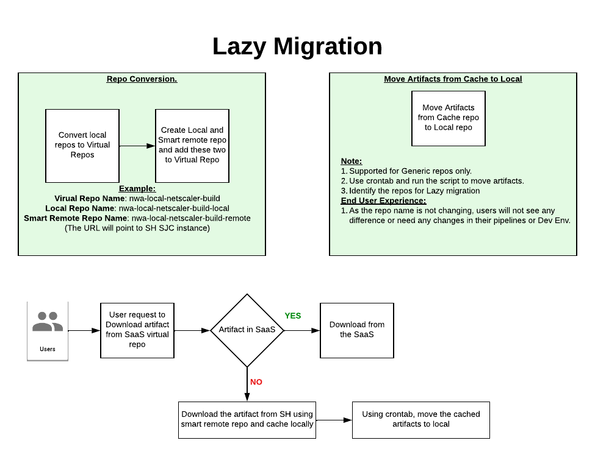

# Lazy Migration of Artifacts from Source to Target JPD

## Description
Lazy migration is a process of copying artifacts from Source to Target JPD. Using this lazy migration, required artifacts are migrated from Source to Target instead of moving all the artifacts. 

Below is the Design and flow of Lazy Migartion
This is a two step process
1. Repo Conversion and mapping
2. Move artifacts from cache to local


### PROS
* Copy those artifacts that are needed in new Env.
* No need of performing cleanup at source before migartion
* Save Space in target JPD.

### CONS
* Both JPD's must be active till you run the lazy migration
* Connectivity between JPD's

## Usage
1. Do config transfer from Source to Target JPD

2. Ensure that you have the JFrog CLI (`jf`) and `jq`installed and configured to Target JPD

3. Repo Conversion script. `repoconverandmap.sh`
   ```bash
   repoconverandmap.sh target-jpd https://smartremotejpd.jfrog.io user1 password
   ```
    - `<SERVER_ID>`: The server ID of the Artifactory instance.
    - `<remotejpdname>`: The smart remote jpd URL
    - `<user>`: Username with read access to smart remote repo 
    - `<password>`: password or token
 
4. Crontab to move artifacts from cache to local. 
   Note: Update the 2 variables in the files `movecachetolocal.sh`
   ```bash
    # Run script daily once. Update the path of the script and logs.
    0 0 * * * $HOME/move-from-cache-to-local.sh > $HOME/move-from-cache-to-local-`date +\%Y\%m\%d\%H\%M\%S`.log 2>&1
   ```

## Disclaimer
This script is provided as a utility and should be used responsibly in accordance with any relevant terms of use and licensing agreements for JFrog products and services. JFrog is not responsible for any issues or consequences arising from the use of this script.
